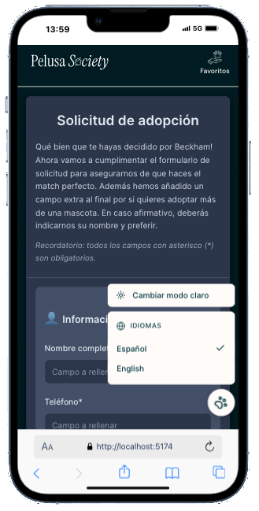
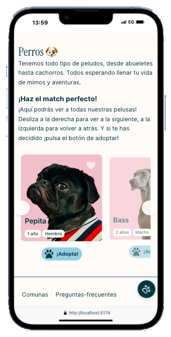

# 🐾 Pelusa Society - Adopción responsable de perros y gatos

 


**Pelusa Society** es un proyecto web desarrollado en React para la adopción de perros y gatos. 
Utiliza sliders interactivos optimizados para controles táctiles de móvil.

Se trata de un proyecto de clase para el **bootcamp** impartido por **Factoría F5**.

## 🚀 Características Principales

- **Slider con diseño avanzado**: Interfaz dinámica e intuitiva para descubrir perros o gatos con controles táctiles.
- **Página de favoritos**: Guarda a tus animales favoritos en una lista antes de decidir cuál adoptas.
- **Formulario de adopción**: El formulario para iniciar el proceso de adopción una vez seleccionada una mascota.
- **Modo oscuro y idiomas**: Se puede seleccionar entre modo claro y oscuro y entre castellano e inglés.

## 📱 Un diseño Mobile-First

En nuestro equipo tuvimos la suerte de contar con datos de usuarios recogidos con una encuesta. Esta información nos indicó que **la gran mayoría de personas que adoptan mascotas lo hacen a través de móvil**. Por ello, decidimos centrar todos nuestros recursos y nuestro tiempo en **una aplicación mobile de la mayor calidad que pudiéramos alcanzar**. La web es escalable a futuro para tener en cuenta el pequeño porcentaje más reticente a utilizar el teléfono, pero nuestra prioridad fue **que la web resultara atractiva para el abrumador porcentaje de usuarios de móvil**.

<details>
  <summary>Encuesta sobre adopción de animales a través de Internet</summary>
  
<p><b>🎯 Objetivo</b>: Detectar posibles fricciones o necesidades en la experiencia digital de adopción de animales.<br>
📊 <strong>Muestra</strong>: 93 personas.<br>
🔠 <b>Metodología</b>: Encuesta online anónima. Edad media: 25-45 años.<br>
🗓️ <b>Fecha</b>: Diciembre 2024.<br>
  
<h3> 🔎 Preguntas relevantes:</h3><br>
<b>¿Desde qué dispositivo realizaste (o realizarías) la solicitud de adopción de una mascota?</b><br>
Desde el móvil (smartphone) – 82%<br>
Desde un ordenador (portátil o sobremesa) – 12%<br>
Desde una tablet – 4%<br>
No recuerdo / No estoy segura – 2%<br>

<b>¿Con qué frecuencia consultas perfiles de animales en adopción desde el móvil?</b><br>
A diario – 25%<br>
Varias veces por semana – 34%<br>
Una vez por semana – 28%<br>
Rara vez – 13%<br>

<b>¿Te resultó fácil hacer todo el proceso desde el móvil?</b><br>
Sí, muy fácil – 68%<br>
Sí, aunque algunos pasos no estaban adaptados – 21%<br>
No, preferí cambiarme al ordenador – 11%<br>
  
**📌 Conclusión:**<br>
El tráfico mobile <b>supera el 96% a nivel global</b>. En el contexto específico de formularios más largos o procesos serios como adopciones, hay tan solo una pequeña resistencia que ronda entre el 10% y el 20% y que sigue prefiriendo el escritorio. La prioridad clara debería ser <b>el diseño mobile-first</b> para satisfacer la demanda de la gran mayoría de personas que adoptan.</p><br>
</details>

## 🛠 Tecnologías Utilizadas

- **Frontend**: 
  
  

- **Backend**:
  🐶 Conexión con la API Huachitos (https://huachitos.cl/docs)

## 🌳 Estructura del proyecto
```bash
PelusaSociety/
├── .gitignore
├── eslint.config.js
├── index.html
├── package-lock.json
├── package.json
├── public/
├── README.md
├── src/
│   ├── App.css
│   ├── App.jsx
│   ├── assets/
│   ├── components/
│   │   ├── Btn/
│   │   │   ├── Btn.css
│   │   │   └── Btn.jsx
│   │   ├── ButtonFavorites/
│   │   │   ├── ButtonFavorites.css
│   │   │   └── ButtonFavorites.jsx
│   │   ├── CardCategory/
│   │   │   ├── CardCategory.css
│   │   │   └── CardCategory.jsx
│   │   ├── Footer/
│   │   │   ├── Footer.css
│   │   │   └── Footer.jsx
│   │   ├── NavBar/
│   │   │   ├── NavBar.css
│   │   │   └── NavBar.jsx
│   │   ├── PetCard/
│   │   │   ├── PetCard.css
│   │   │   └── PetCard.jsx
│   │   └── PetSlider/
│   │       ├── PetSlider.css
│   │       └── PetSlider.jsx
│   ├── context/
│   │   └── ThemeContext.js
│   ├── img/
│   │   ├── instagram.svg
│   │   └── tools.svg
│   ├── index.css
│   ├── main.jsx
│   ├── pages/
│   │   ├── AdoptPage.jsx
│   │   ├── FavouritesPage.jsx
│   │   ├── HomePage.css
│   │   └── HomePage.jsx
│   ├── reducers/
│   │   └── favoritesReducer.js
│   └── services/
│       └── PetService.js
└── vite.config.js
```

